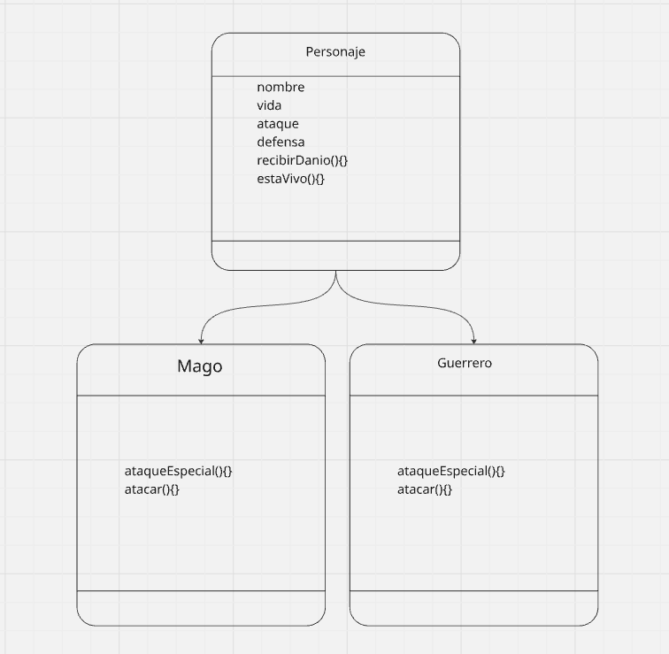

## diagrama de case

### explicación de uno

**comando de completo de clonación y instalación**

`git clone https://github.com/DaSilvaFelix/mi-primer-juego-.git && cd mi-primer-juego- && npm i && npm run start`

#### **comando por separado:**

**comando para clonar repositorio:**
`git clone https://github.com/DaSilvaFelix/mi-primer-juego-.git`

**comando para acceder a la acceder a la carpeta:**
`cd mi-primer-juego-`

**comando para instalar chalk:**
`npm i`

**comando para ejecutar el programa:**
`npm run start`
